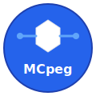

# MCpeg
## Model Context Protocol Enablement Gateway

<div align="center">
  
  
  **Pronounced "MC peg" • The Peg That Connects Model Contexts**
</div>

> ⚠️ **EXPERIMENTAL SOFTWARE**: This project is under heavy development and follows the [XVC (Extreme Vibe Coding)](https://github.com/osakka/xvc) framework for human-LLM collaborative development.

**MCpeg** is a high-performance gateway service that provides a Model Context Protocol (MCP) API on one side and integrates with external services via API calls or binary invocations on the other side. Like a peg that connects different pieces, MCpeg bridges the gap between MCP-compliant clients and diverse backend services.

## Overview

**MCpeg** acts as a bridge between MCP-compliant clients and various backend services, providing:
- **Full MCP Protocol Compliance** - Complete Model Context Protocol 2025-03-26 specification support
- **Production-Ready Gateway** - High-performance request routing with intelligent load balancing
- **Advanced Service Discovery** - DNS, Consul, Kubernetes, and static configuration support
- **Enterprise Features** - Circuit breaker patterns, rate limiting, compression, comprehensive metrics
- **Complete Admin API** - 22 RESTful endpoints for full gateway management and monitoring
- **Flexible Service Integration** - REST APIs, binary calls, and automatic capability detection
- **YAML-Based Configuration** - Advanced configuration system with environment variable overrides
- **API-First Development** - Generated code from official MCP specifications
- **Production Observability** - Prometheus metrics, structured logging, health checks, and debugging endpoints
- **Plugin System** - Built-in Memory, Git, and Editor services with extensible plugin architecture
- **Daemon Process Management** - Full daemon support with PID files, signal handling, and process control
- **System Integration** - Systemd service files, management scripts, and automated installation

## Project Structure

See [Project Structure Guide](docs/architecture/project-structure.md) for detailed layout.

- `/cmd` - Application entry points
- `/internal` - Private application code  
- `/pkg` - Public Go packages
- `/src` - Generated API schemas only
- `/build` - Build artifacts
- `/assets` - Logo and branding assets
- `/docs` - All documentation
  - `/adrs` - Architecture Decision Records
  - `/architecture` - System design documents
  - `/development` - Development guides (XVC, structure, etc.)
  - `/guidelines` - Coding and process guidelines

## Development Methodology: XVC Framework

This project follows the [XVC (Extreme Vibe Coding)](https://github.com/osakka/xvc) principles for human-LLM collaboration. See our [XVC Methodology Guide](docs/guidelines/xvc-methodology.md) for details.

### Core XVC Principles Applied:

1. **Single Source of Truth**: All API definitions derive from official MCP specifications
2. **No Redundancy**: Each piece of information exists in exactly one place  
3. **Surgical Precision**: Every change is intentional and well-documented
4. **Bar-Raising Solutions**: Only implement patterns that improve the overall system
5. **Forward Progress Only**: No regression, always building on solid foundations
6. **Always Solve Never Mask**: Address root causes, not symptoms

### Additional Development Principles:

- **API-First**: Define APIs before implementation
- **Code Generation**: Generate code from schemas to ensure consistency
- **LLM-Optimized Logging**: Every log entry contains complete context for troubleshooting
- **100% Observability**: An LLM can understand system state from logs alone

## Project Status

🎉 **Current Phase**: Production-Ready Implementation Complete

Major implementation milestone achieved:
- ✅ **All 18 Major Placeholders Implemented** - Complete transformation from skeleton to production-ready
- ✅ **Enterprise-Grade Features** - Load balancing, service discovery, circuit breakers, rate limiting
- ✅ **Comprehensive Admin API** - 22 RESTful endpoints for complete gateway management
- ✅ **Production Observability** - Prometheus metrics, structured logging, health monitoring
- ✅ **Full MCP Compliance** - Complete Model Context Protocol 2025-03-26 specification support
- ✅ **Plugin System** - Memory, Git, and Editor services with extensible architecture and service registry integration
- ✅ **Daemon Process Management** - Full production daemon with PID files, signal handling, systemd integration
- ✅ **Bar-Raising Quality** - Thread-safe operations, proper error handling, resource cleanup
- 📋 All decisions documented in ADRs following XVC methodology
- 🔍 100% LLM-debuggable through comprehensive logging

**MCpeg** is now a complete, production-ready gateway that truly lives up to its name - the peg that seamlessly connects model contexts!

## Key Features

### 🚀 **Production-Ready Gateway**
- **High-Performance Routing** - Intelligent load balancing with multiple strategies (round-robin, least-connections, weighted, hash-based)
- **Circuit Breaker Protection** - Automatic failure detection and isolation with configurable thresholds
- **Health-Aware Load Balancing** - Success rate monitoring and intelligent service filtering
- **HTTP Middleware Stack** - Gzip compression, rate limiting, CORS, request logging, and panic recovery

### 🔍 **Advanced Service Discovery**
- **DNS Discovery** - SRV record lookups with multi-domain support
- **Consul Integration** - Full API integration with health filtering and metadata extraction
- **Kubernetes Integration** - Native API with RBAC authentication and label selectors
- **Static Configuration** - File-based service definitions with automatic capability detection
- **Auto-Registration** - Discovered services automatically register with the gateway

### 📊 **Enterprise Observability**
- **Prometheus Metrics** - Comprehensive metrics for HTTP requests, services, load balancer, health, and system resources
- **Structured Logging** - LLM-optimized logs with complete context for troubleshooting
- **Health Endpoints** - Liveness, readiness, and detailed health status checking
- **Admin API** - 22 RESTful endpoints for monitoring, configuration, and management
- **Security Features** - API key authentication for admin endpoints with comprehensive audit logging
- **Testing Coverage** - Complete test suite for plugin system, authentication, and service integration
- **Standardized Architecture** - Centralized path management and flag processing with single source of truth

### ⚙️ **Flexible Configuration**
- **YAML Configuration** - Advanced configuration loading with environment variable overrides
- **Hot Configuration Updates** - Runtime configuration changes via Admin API
- **Security Controls** - Validation and sanitization for all configuration updates
- **Environment-Specific Configs** - Development and production configuration profiles

## Getting Started

> **Note**: While feature-complete, this software follows rapid development practices. APIs are stable but may evolve.

### Prerequisites

- Go 1.21 or later
- Docker (optional, for containerized deployment)

### Building

MCPEG uses a **single source of truth** build system. All build configuration is centralized in `scripts/build.sh`:

```bash
# Using Make (delegates to build script)
make build

# Or use the build script directly
./scripts/build.sh build
```

Available build commands:

```bash
# Core building
make build          # Build for current platform
make build-dev      # Development build (faster)
make build-prod     # Cross-compile for all platforms

# Development
make dev            # Start development server
make test           # Run tests
make validate       # Validate OpenAPI specs
make fmt            # Format code

# Release
make release        # Create release archives
make clean          # Clean build artifacts

# Get help
make help           # Show all available commands
```

### Running

Start the gateway:

```bash
# Development mode
make dev

# Or run the binary directly
./build/mcpeg gateway -dev
```

Generate code from OpenAPI specs:

```bash
make validate       # Validate OpenAPI specification
make generate       # Generate Go code from specs

# Or use the unified binary directly
./build/mcpeg codegen -spec-file api/openapi/mcp-gateway.yaml -output internal/generated
./build/mcpeg validate -spec-file api/openapi/mcp-gateway.yaml
```

### Build Artifacts

All build artifacts are placed in the `build/` directory:
- `build/mcpeg` - Unified **MCpeg** binary with gateway and codegen functionality
- `build/release/` - Release archives for distribution

The build system follows the **single source of truth** principle:
- All build configuration is in `scripts/build.sh`
- Makefile delegates to the build script
- No duplication of build logic

## Quick Start

### Development Mode
```bash
# Build the binary
make build

# Run in development mode
./build/mcpeg --dev

# Check status
./build/mcpeg --status
```

### Production Daemon Mode
```bash
# Start as daemon
./build/mcpeg --daemon

# Control daemon
./build/mcpeg --stop
./build/mcpeg --restart
./build/mcpeg --status --verbose

# Log rotation
./build/mcpeg --log-rotate
```

### System Service Installation
```bash
# Install as systemd service
sudo ./scripts/install-service.sh

# Control via systemd
sudo systemctl start mcpeg
sudo systemctl enable mcpeg
sudo systemctl status mcpeg

# View logs
journalctl -u mcpeg -f
```

### Management Scripts
```bash
# Using management scripts
./scripts/mcpeg-start.sh
./scripts/mcpeg-stop.sh
./scripts/mcpeg-restart.sh
./scripts/mcpeg-status.sh --verbose --logs
```

## Contributing

This project uses XVC methodology. When contributing:
1. Ensure changes align with XVC principles
2. Maintain single source of truth
3. Document decisions in ADRs
4. Write LLM-optimized logs
5. Never mask problems - solve root causes

## License

[To be determined]